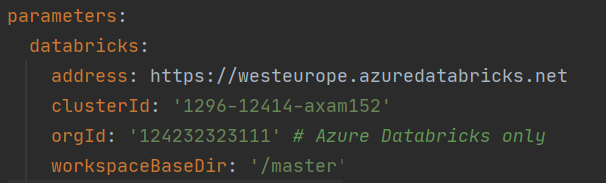
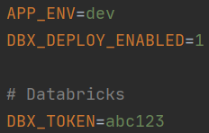

<!-- PROJECT LOGO -->
<br />
<p align="center">
  <a href="https://github.com/Todo">
    
  </a>

  <h3 align="center">Bricksflow Framework project template</h3>

  <p align="center">
    This is a Bricksflow project skeleton covering best practices for working with Databricks. Any SW Engineering knowledge required, one code for all environments, interactive development, central configs & datalake structure, automatic documentation & lineage, ready for CI/CD and more.
    <br />
    <a href="https://github.com/othneildrew/Best-README-Template"><strong>TODO Explore the docs »</strong></a>
    <br />
    <br />
    <a href="https://github.com/othneildrew/Best-README-Template">TODO View Demo</a>
    ·
    <a href="https://github.com/othneildrew/Best-README-Template/issues">TODO Report Bug</a>
    ·
    <a href="https://github.com/othneildrew/Best-README-Template/issues">TODO Request Feature</a>
  </p>
</p>


<!-- TABLE OF CONTENTS -->
<details open="open">
  <summary>Table of Contents</summary>
  <ol>
    <li><a href="#about-the-project">About The Project</a></li>
    <li><a href="#usage">Usage</a></li>
    <li>
      <a href="#getting-started">Getting Started</a>
      <ul>
        <li><a href="#prerequisites">Prerequisites</a></li>
        <li><a href="#installation">Installation</a></li>
        <li><a href="#installation">Important scripts</a></li> 
      </ul>
    </li>
    <li><a href="#roadmap">Roadmap</a></li>
    <li><a href="#contributing">Contributing</a></li>
    <li><a href="#license">License</a></li>
    <li><a href="#contact">Contact</a></li>
    <li><a href="#acknowledgements">Acknowledgements</a></li>
  </ol>
</details>


<!-- ABOUT THE PROJECT -->
## About The Project

This is a Bricksflow project skeleton covering our **best practices for Databricks projects**. Bricksflow is focused on the following paradigms:

* anyone with basic python skills can create pipelines and improve the business logic,
* developing a standard DataLake project requires almost no engineers,
* one code for all environments dev, test, prod
* working with your favorite IDE and/or Databricks UI,
* pursue consistency as the project grows.

**Base components** to be used by everyone:

1. Configuration in YAML
1. Tables & schema management
1. Automated deployment to Databricks
1. Documentation automation

**Advanced components** to be used mostly by engineers:

1. Production releases workflow
1. Unit & pipeline testing
1. Extensions API

Read more at [Bricksflow: Databricks development made convenient
](https://medium.com/datasentics/bricksflow-databricks-development-made-convenient-3b0cc486c856)  


### Built With

This section should list any major frameworks that you built your project using. Leave any add-ons/plugins for the acknowledgements section. Here are a few examples.
* [Bootstrap](https://getbootstrap.com)
* [JQuery](https://jquery.com)
* [Laravel](https://laravel.com)

<!-- USAGE EXAMPLES -->
## Usage

Use this space to show useful examples of how a project can be used. Additional screenshots, code examples and demos work well in this space. You may also link to more resources.

_For more examples, please refer to the example notebooks [Documentation](docs/)


<!-- GETTING STARTED -->
## Getting Started

This is an example of how you may give instructions on setting up your project locally.
To get a local copy up and running follow these simple example steps.

### Prerequisites

#### Local environment setup

The following software needs to be installed first:
  * [Miniconda package manager](https://docs.conda.io/en/latest/miniconda.html)
  * [Git for Windows](https://git-scm.com/download/win) or standard Git in Linux (_apt-get install git_)
  
We recommend using the following IDEs:  
  * [PyCharm Community or Pro](https://www.jetbrains.com/pycharm/download/) with the [EnvFile plugin](https://plugins.jetbrains.com/plugin/7861-envfile) installed
  * [Visual Studio Code](https://code.visualstudio.com/download) with the [PYTHONPATH setter extension](https://marketplace.visualstudio.com/items?itemName=datasentics.pythonpath-setter) installed


### Installation

* On **Windows**, use Git Bash.
* On **Linux/Mac**, the use standard terminal 

```
# check documentation on https://github.com/bricksflow/project-creator

source <(curl -s https://raw.githubusercontent.com/bricksflow/project-creator/master/create_project.sh)
```

When the environment setup is completed, [configure your Databricks cluster connection details](https://docs.databricks.com/dev-tools/databricks-connect.html#step-2-configure-connection-properties):

Update *src/[ROOT_MODULE]/_config/config_dev.yaml* with your Databricks `address`, `clusterId` and `orgId` (Azure only).



Add your Databricks token to the `[PROJECT_ROOT]/.env` file




#### Activate your project environment

Now activate the Conda environment for your new project:

```bash
$ conda activate $PWD/.venv
```

or use a shortcut

```bash
$ ca
```

### Important scripts

1. `console dbx:deploy --env=dev` to upload notebooks & configs from local to Databricks
1. `console dbx:workspace:export --env=dev` to download notebooks from Databricks to local
1. ```./pylint.sh``` - checks coding standards
1. ```console container:test-init``` - runs tests


<!-- ROADMAP -->
## Roadmap

See the [open issues](https://github.com/othneildrew/Best-README-Template/issues) for a list of proposed features (and known issues).


<!-- CONTRIBUTING -->
## Contributing

Contributions are what make the open source community such an amazing place to be learn, inspire, and create. Any contributions you make are **greatly appreciated**.

1. Fork the Project
2. Create your Feature Branch (`git checkout -b feature/AmazingFeature`)
3. Commit your Changes (`git commit -m 'Add some AmazingFeature'`)
4. Push to the Branch (`git push origin feature/AmazingFeature`)
5. Open a Pull Request


<!-- LICENSE -->
## License

Distributed under the MIT License. See `LICENSE` for more information.


<!-- CONTACT -->
## Contact

Your Name - [@your_twitter](https://twitter.com/your_username) - email@example.com

Project Link: [https://github.com/your_username/repo_name](https://github.com/your_username/repo_name)


<!-- ACKNOWLEDGEMENTS -->
## Acknowledgements
* [GitHub Emoji Cheat Sheet](https://www.webpagefx.com/tools/emoji-cheat-sheet)
* [Img Shields](https://shields.io)
* [Choose an Open Source License](https://choosealicense.com)
* [GitHub Pages](https://pages.github.com)
* [Animate.css](https://daneden.github.io/animate.css)
* [Loaders.css](https://connoratherton.com/loaders)
* [Slick Carousel](https://kenwheeler.github.io/slick)
* [Smooth Scroll](https://github.com/cferdinandi/smooth-scroll)
* [Sticky Kit](http://leafo.net/sticky-kit)
* [JVectorMap](http://jvectormap.com)
* [Font Awesome](https://fontawesome.com)


